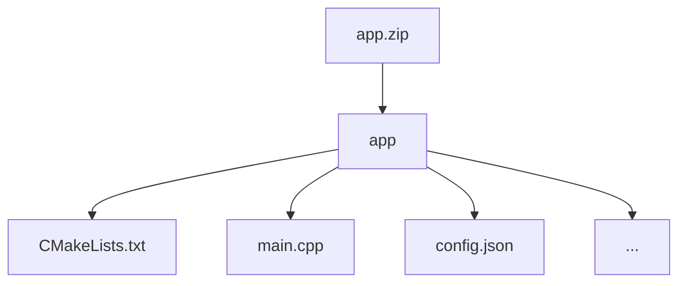

# Private Fraud Detection via Homomorphic Support Vector Machines
The challenge deadline is extended by two weeks to give participants more time to refine and improve their solutions.

📅 New deadline: March 4, 2025 

## Introduction
Fraud detection is a vital component of financial security, yet it typically requires investigations on sensitive data that cannot always be openly exposed. This challenge focuses on utilizing Fully Homomorphic Encryption (FHE) to ensure privacy while detecting fraudulent transactions. Participants will train a Support Vector Machine (SVM) model to accurately classify transactions as legitimate or fraudulent, leveraging FHE for privacy-preserving inference. This might not just enhance fraud protection, but also set a new standard for safeguarding sensitive financial information.

### Goals

The goals of this challenge are:
1. **Train an SVM model** using conventional machine learning techniques on the provided unencrypted dataset.
2. **Implement FHE-based inference** — use the trained SVM model to classify encrypted transactions under FHE, ensuring that the entire inference, including the decision function and any kernel evaluations, occurs under encryption.

**Participants who will submit non-SVM model for this challenge might be disqualified.**

## Challenge info

1. **Challenge type:** this challenge is a White Box challenge. Participants are required to submit the project with their source code. You can learn more about this and other types of challenges in our [Participation guide](https://fherma.io/how_it_works).
2. **Encryption scheme:** CKKS.
3. **Supported libraries:** [OpenFHE](https://github.com/openfheorg/openfhe-development) — C++, Python, or Rust.
4. **Input**:
    - **Testing data** — a dataset of FHE-encrypted samples for classification.
    - **Cryptocontext** provided for FHE operations.
    - **Keys** — public key, multiplication key, Galois keys.
5. **Output**: the output should be an encrypted vector containing the results of transaction evaluations, where:
      - `-1` represents a legitimate transaction.
      - `1` represents a fraudulent transaction.

## Timeline

- **November 18, 2024** — start date;
- **March 4, 2025, at 23:59 UTC** — submission deadline;
- **March 15, 2025** — prize awarded.


## Datasets

- **Training Dataset** is a preprocessed subset of [Ethereum Fraud Detection Dataset](https://www.kaggle.com/datasets/vagifa/ethereum-frauddetection-dataset/data), consisting of [X_train.csv](https://github.com/fairmath/fherma-challenges/blob/main/ethereum-fraud-detection/data/X_train.csv) and [y_train.csv](https://github.com/fairmath/fherma-challenges/blob/main/ethereum-fraud-detection/data/y_train.csv)
- **Usage:** Feel free to split the provided dataset into training and validation sets.
- **Submissions** will be validated on a non-provided testing dataset.

**During model training, only the processed dataset provided above is allowed to be used.**

## Encoding technique
During testing, the application will receive an encrypted transaction as input.
By default, we pack the input vector X in ciphertext as follows:

| x0 | x1 | x2 | x3 | ... | 
|--------|--------|--------|--------|--------|

The \(i\)-th slot corresponds to the value of the parameter specified in column \(i\) of the given dataset.
The first slot of the resulting vector should contain the classification result:

| -1 | ... | 
| -------- |--------|

If you need the data to be packaged in a different format, please open an issue on GitHub and we will prepare a new cipher.
## Test environment
### Hardware

- **CPU:** 12 cores
- **RAM:** 54 GB

### Software

The following libraries/packages will be used for generating test case data and for testing solutions:
- **OpenFHE:** v1.2.0 
- **OpenFHE-Python:** v0.8.8

## Submission
### General requirements

1. **Full FHE implementation.** The SVM decision function and any other functions, e.g. non-linear kernel function, must be executed entirely under FHE.
2. **No post-processing.** The owner of the encrypted data should receive an encrypted classification result ready for decryption, with no additional computations required.
3. **Strictly SVM**. Participants who will submit non-SVM model for this challenge might be disqualified from it.
4. **Code**. Include the code used to train the SVM model.

### Application requirements

To address this challenge, participants can utilize the [OpenFHE library](https://openfhe.org/) with any of the supported languages: **Rust**, **C++**, or **Python**. For solutions developed in **C++** we expect to see a `CMake` project, with the `CMakeLists.txt` file placed in the project's root directory.

Please adhere to the following format when submitting your solution:
- **File format** — submission should be a ZIP archive.
- **Directory structure**
    - Inside the ZIP archive, ensure there is a directory titled `app`.
    - Within the `app` directory, include your main `CMakeLists.txt` file (or Python- and Rust-related build files) and other source files. Please exclude all unnecessary files related to testing and/or other challenges.



- **Config file** `config.json` to specify execution parameters like `indexes_for_rotation_key`, `mult_depth`, `plaintext_modulus`, `ring_dimension`, etc.

#### Config file

You can use a config file to set parameters for generating a context on the server for testing the solution. An example of such a config is given below.


```json
{
    "indexes_for_rotation_key": [
        1
    ],
    "mult_depth": 29,
    "ring_dimension": 131072,
    "scale_mod_size": 59,
    "first_mod_size": 60,
    "batch_size": 65536,
    "enable_bootstrapping": false,
    "levels_available_after_bootstrap": 10,
    "level_budget": [4,4]
}
```

There are more info on possible config file parameters and their default values in our [Participation guide](https://fherma.io/how_it_works).

### Command-line interface (CLI)

The application must support the following CLI:
- **--tx** [path]: the path to the file where the input ciphertext is located.
- **--output** [path]: the path to the file where the classification result should be written.
- **--cc** [path]: the path to the serialized crypto context file in **BINARY** form.
- **--key_public** [path]: the path to the public key file.
- **--key_mult** [path]: the path to the evaluation (multiplication) key file.
- **--key_rot** [path]: the path to the rotation key file.


The executable will be run as follows:

```bash
./app --tx data.bin --cc cc.bin --key_public pub.bin --key_mult mult.bin --output result.bin
```

## Evaluation criteria

Submissions will be evaluated on the non-provided dataset and scored with the following criteria:

1. **Recall:** the percentage of correctly classified fraudulent transactions.
2. **Precision:** the percentage of truly fraudulent transactions among those classified as fraudulent.
3. **F1 score:** the harmonic mean of recall and precision. 
4. **Execution time:** the average time taken to classify each sample.

## Scorring & awards

Two winners will be chosen in this challenge:

1. **Fastest solution**: the solution with minimum execution time and f1 score of at least 85%.
2. **Most accurate solution**: the solution with the highest overall quality, primarily assessed by f1 score. Precision and recall will also be considered for the final decision.

The winner in each category will be awarded **$2000**.

One participant can be the winner in all categories. Total prize fund is **$4000**.

## Challenge committee
- [Andreea Alexandru](https://www.linkedin.com/in/andreea-alexandru-826bb6a4/), Duality
- [Ahmad Al Badawi](https://www.linkedin.com/in/ahmad-al-badawi/), Duality
- [Gurgen Arakelov](https://www.linkedin.com/in/gurgen-arakelov-943172b9/), Fair Math
- [Sergey Gomenyuk](https://www.linkedin.com/in/sergey-gomenyuk-7a355a42/), Fair Math
- [Valentina Kononova](https://www.linkedin.com/in/valentina-kononova-a9a23b180/), Fair Math
- [Yuriy Polyakov](https://www.linkedin.com/in/yuriy-polyakov-796b84a/), Duality

## Useful links
### FHE

- [FHERMA participation guide](https://fherma.io/how_it_works)—more about FHERMA challenges.
- [OpenFHE](https://github.com/openfheorg/openfhe-development) repository, README, and installation guide.
- [OpenFHE Python](https://github.com/openfheorg/openfhe-python) repository, README, and installation guide.
- [OpenFHE-rs](https://crates.io/crates/openfhe) Rust wrapper, a [walk-through tutorial](https://fherma.io/content/660174e7fce06722c1149a95) and [documentation](https://openfhe-rust-wrapper.readthedocs.io/en/latest/).
- A vast collection of resources [FHE Resources](https://fhe.org/resources), including tutorials and walk-throughs, use-cases and demos.
- [Polycircuit:](https://github.com/fairmath/polycircuit) FHE Components Library

### SVM and ML

- [SVM for dummies from MIT](https://web.mit.edu/6.034/wwwbob/svm-notes-long-08.pdf)
- [SVM in ML](https://eitca.org/artificial-intelligence/eitc-ai-mlp-machine-learning-with-python/support-vector-machine/support-vector-machine-fundamentals/examination-review-support-vector-machine-fundamentals/what-is-the-main-goal-of-svm-and-how-does-it-achieve-it/)
- [LIBSVM: A Library for Support Vector Machines](https://www.csie.ntu.edu.tw/~cjlin/papers/libsvm.pdf)
- [Fast homomorphic SVM inference on encrypted data](https://link.springer.com/article/10.1007/s00521-022-07202-8)
- [OpenFHE AAAI 2024 Tutorial](https://openfheorg.github.io/aaai-2024-lab-materials/)—a tutorial on using Fully Homomorphic Encryption for Privacy-Preserving Machine Learning Using the OpenFHE Library.


## Help

If you have any questions, you can:
- Contact us by email [support@fherma.io](mailto:support@fherma.io)
* Join our [Discord](https://discord.gg/NfhXwyr9M5) server and ask your questions in the [#fherma channel](https://discord.com/channels/1163764915803279360/1167875954392187030). You can also find a team in the [teams channel](https://discord.com/channels/1163764915803279360/1246085439480401930)!
- Use [OpenFHE discourse group](https://openfhe.discourse.group/) for OpenFHE-related questions.

Best of luck to all participants!
