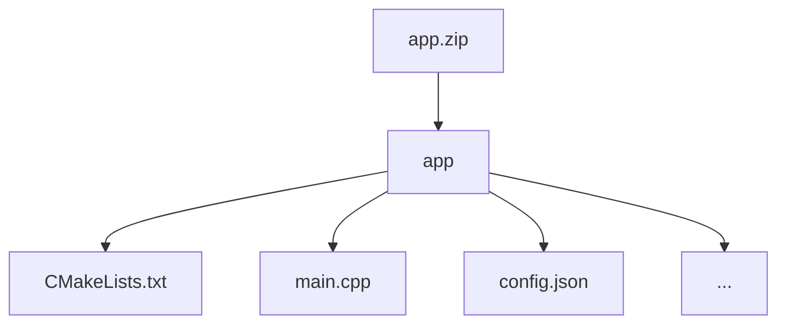

# House Price Prediction
## Introduction

Accurately predicting housing prices is essential in real estate, benefiting everyone from individual buyers to large-scale investors. However, real-world datasets often include sensitive information, raising privacy concerns.

This challenge invites participants to build a regression model for estimating housing prices using Fully Homomorphic Encryption (FHE).

### Goals

The goals of this challenge are:

1. **Train a regression model** using conventional machine learning techniques on the provided unencrypted dataset.
2. **Implement FHE-based inference** — use the trained model to classify encrypted data under FHE, ensuring that the entire inference occurs under encryption.

## Challenge info

1. **Challenge type:** this challenge is a White Box challenge. Participants are required to submit the project with their source code. You can learn more about this and other types of challenges in our [Participation guide](https://fherma.io/how_it_works).
2. **Encryption scheme:** CKKS.
3. **Supported libraries:** [OpenFHE](https://github.com/openfheorg/openfhe-development) — C++, Python, or Rust.
4. **Input**:
    - **Testing data** — a dataset of FHE-encrypted samples for classification.
    - **Cryptocontext** provided for FHE operations.
    - **Keys** — public key, multiplication key, Galois keys.
5. **Output**: the output should be an encrypted vector containing the predicted price

## Timeline

- **December 18, 2024** — start date;
- **March 18, 2025, at 23:59 UTC** — submission deadline;
- **April 1, 2025** — prize awarded.

## Dataset

- **Training Dataset** is a preprocessed subset of [California Housing Prices](https://github.com/fairmath/fherma-challenges/tree/main/house-price-prediciton/data), consisting of X_train & y_train can be found [here](https://github.com/fairmath/fherma-challenges/tree/main/house-price-prediciton/data). Features are described as follows:
    - **longitude**: A measure of how far west a house is located; higher values indicate farther west.
    - **latitude**: A measure of how far north a house is located; higher values indicate farther north.
    - **housing_median_age**: The median age of houses within a block.
    - **total_rooms**: The total number of rooms within a block.
    - **total_bedrooms**: The total number of bedrooms within a block.
    - **population**: The total number of people residing within a block.
    - **households**: The total number of households within a block, where a household is a group of people living in a single housing unit.
    - **median_income**: The median income of households within a block, measured in tens of thousands of US dollars.
    - **ocean_proximity_{} columns**: the one-hot encoded columns derived from the original ocean_proximity column, indicating the block's location relative to the ocean.
    - **median_house_value**: The median house value for households within a block, measured in US dollars (the target value).
- **Usage:** Feel free to split the provided dataset into training and validation sets.
- **Submissions** will be validated on a non-provided testing dataset.

**During model training, only the [processed dataset](https://github.com/fairmath/fherma-challenges/tree/main/house-price-prediciton/data) provided above is allowed to be used.**

## Encoding technique

During testing, the application will receive an encrypted transaction as input.

By default, we pack the input vector X in ciphertext as follows:

| x0 | x1 | x2 | x3 | … |
| --- | --- | --- | --- | --- |

The (i)-th slot corresponds to the value of the parameter specified in column (i) of the given dataset.

The first slot of the resulting vector should contain the classification result:

| 50000 | … |
| --- | --- |

If you need the data to be packaged in a different format, please open an issue on GitHub and we will prepare a new cipher.
## Test environment
### Hardware

- **CPU:** 12 cores
- **RAM:** 54 GB

### Software

The following libraries/packages will be used for generating test case data and for testing solutions:
- **OpenFHE:** v1.2.0 
- **OpenFHE-Python:** v0.8.8

## Submission
### General requirements

1. **Full FHE implementation.** The inference functions must be executed entirely under FHE.
2. **No post-processing.** The owner of the encrypted data should receive an encrypted result ready for decryption, with no additional computations required.

### Application requirements

To address this challenge, participants can utilize the [OpenFHE library](https://openfhe.org/) with any of the supported languages: **Rust**, **C++**, or **Python**. For solutions developed in **C++** we expect to see a `CMake` project, with the `CMakeLists.txt` file placed in the project's root directory.

Please adhere to the following format when submitting your solution:
- **File format** — submission should be a ZIP archive.
- **Directory structure**
    - Inside the ZIP archive, ensure there is a directory titled `app`.
    - Within the `app` directory, include your main `CMakeLists.txt` file (or Python- and Rust-related build files) and other source files. Please exclude all unnecessary files related to testing and/or other challenges.



- **Config file** `config.json` to specify execution parameters like `indexes_for_rotation_key`, `mult_depth`, `plaintext_modulus`, `ring_dimension`, etc.

#### Config file

You can use a config file to set parameters for generating a context on the server for testing the solution. An example of such a config is given below.


```json
{
    "indexes_for_rotation_key": [
        1
    ],
    "mult_depth": 29,
    "ring_dimension": 131072,
    "scale_mod_size": 59,
    "first_mod_size": 60,
    "batch_size": 65536,
    "enable_bootstrapping": false,
    "levels_available_after_bootstrap": 10,
    "level_budget": [4,4]
}
```

There are more info on possible config file parameters and their default values in our [Participation guide](https://fherma.io/how_it_works).

### Command-line interface (CLI)

The application must support the following CLI:
- **--sample** [path]: the path to the file where the input ciphertext is located.
- **--output** [path]: the path to the file where the classification result should be written.
- **--cc** [path]: the path to the serialized crypto context file in **BINARY** form.
- **--key_public** [path]: the path to the public key file.
- **--key_mult** [path]: the path to the evaluation (multiplication) key file.
- **--key_rot** [path]: the path to the rotation key file.


The executable will be run as follows:

```bash
./app --sample data.bin --cc cc.bin --key_public pub.bin --key_mult mult.bin --output result.bin
```

## Evaluation criteria

Submissions will be evaluated on the non-provided dataset and scored with the following criteria:

1. **Mean Absolute Error (MAE):** calculates the average difference between the calculated values and actual values. It shows how far the model’s prediction from the true house price.
2. **Mean Squared Error (MSE):** the average squared difference between the estimated values and true value. The MSE incorporates both the variance of the estimator and its bias.
3. **R-squared (Coefficient of Determination):** the proportion of variation in the dependent variable (y) that is accounted for by the regression line, compared to the variation explained by the mean of y. Essentially, it measures how much more accurately the regression line predicts each point’s value compared to simply using the average value of y.
4. **Execution time:** the average time taken to classify each sample.

## Scoring & awards

Two winners will be chosen in this challenge:

1. **Fastest solution**: the solution with minimum execution time and R-squared score of at least 85%.
2. **Most reliable solution**: the solution with the highest overall quality, primarily assessed by R-squared score. MAE and MSE will also be considered for the final decision

The winner in each category will be awarded **$1500**.

One participant can be the winner in all categories. Total prize fund is **$3000**.

## Useful links

- [FHERMA participation guide](https://fherma.io/how_it_works)—more about FHERMA challenges.
- [OpenFHE](https://github.com/openfheorg/openfhe-development) repository, README, and installation guide.
- [OpenFHE Python](https://github.com/openfheorg/openfhe-python) repository, README, and installation guide.
- [OpenFHE-rs](https://crates.io/crates/openfhe) Rust wrapper, a [walk-through tutorial](https://fherma.io/content/660174e7fce06722c1149a95) and [documentation](https://openfhe-rust-wrapper.readthedocs.io/en/latest/).
- A vast collection of resources [FHE Resources](https://fhe.org/resources), including tutorials and walk-throughs, use-cases and demos.
- [Polycircuit:](https://github.com/fairmath/polycircuit) FHE Components Library

## Help

If you have any questions, you can:
- Contact us by email [support@fherma.io](mailto:support@fherma.io)
* Join our [Discord](https://discord.gg/NfhXwyr9M5) server and ask your questions in the [#fherma channel](https://discord.com/channels/1163764915803279360/1167875954392187030). You can also find a team in the [teams channel](https://discord.com/channels/1163764915803279360/1246085439480401930)!
- Use [OpenFHE discourse group](https://openfhe.discourse.group/) for OpenFHE-related questions.

Best of luck to all participants!
