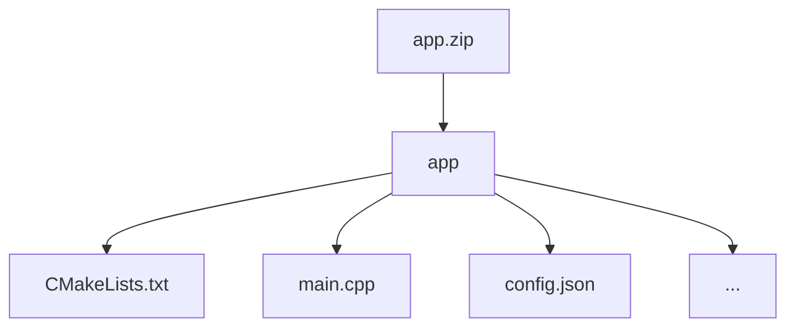

# k-Nearest Neighbors Search
## Introduction

k-nearest neighbors (kNN) search finds the k nearest vectors to a given query and is used in many AI applications, including recommendation systems, semantic search, retrieval-augmented generation (RAG) systems, etc. 

This challenge invites participants to implement a k-nearest neighbors algorithm for encrypted two-dimensional vectors using cosine similarity. The input vector is encrypted, while dataset containing the target vectors is not encrypted. The task is to enable kNN search ensuring the privacy of the query vector and the retrieved nearest neighbors.

### Goals

The goals of this challenge are:

1. Measure the similarity between the input vector and the target vectors using cosine similarity.
2. Return the 10 nearest neighbors to the input vector.

## Challenge info

1. **Challenge type:** this challenge is a White Box challenge. Participants are required to submit the project with their source code. You can learn more about this and other types of challenges in our [Participation guide](https://fherma.io/how_it_works).
2. **Encryption scheme:** CKKS.
3. **Supported libraries:** [OpenFHE](https://github.com/openfheorg/openfhe-development) — C++, Python, or Rust.
4. **Input**:
    - **Testing data** — a dataset of FHE-encrypted vectors.
    - **Cryptocontext** provided for FHE operations.
    - **Keys** — public key, multiplication key, Galois keys.
5. **Output**: the output should be an encrypted vector containing indices of the 10 nearest neighbors

## Timeline

- **January 17, 2025** — start date;
- **March 17, 2025, at 23:59 UTC** — submission deadline;
- **April 1, 2025** — prize awarded.

## Dataset

- **Target vectors** are randomly generated two-dimensional vectors. You can download the dataset [here](https://github.com/fairmath/fherma-challenges/blob/main/k-nearest-neighbors-search/data/data.csv)
- **Submissions** will be validated on a non-provided testing dataset.

## Encoding technique

During testing, the application will receive an encrypted vector as input.

By default, we pack the input vector X in ciphertext as follows:

| x0 | x1 | … |
| --- | --- | --- |

The first and second slots correspond to two dimensions of the input vector.

In the resultant ciphertext, the first ten slots represent the indices of the retrieved nearest neighbors. Example:
|29 | 4 | 167 | 835 | 23 | 54 | 67 | 12 | 590 | … |
| --- | --- | --- | --- | --- | --- | --- | --- | --- | --- |

If you need the data to be packaged in a different format, please open an issue on GitHub and we will prepare a new cipher.

## Test environment
### Hardware

- **CPU:** 12 cores
- **RAM:** 54 GB

### Software

The following libraries/packages will be used for generating test case data and for testing solutions:
- **OpenFHE:** v1.2.0 
- **OpenFHE-Python:** v0.8.8

## Submission

### Application requirements

To address this challenge, participants can utilize the [OpenFHE library](https://openfhe.org/) with any of the supported languages: **Rust**, **C++**, or **Python**. For solutions developed in **C++** we expect to see a `CMake` project, with the `CMakeLists.txt` file placed in the project's root directory.

Please adhere to the following format when submitting your solution:
- **File format** — submission should be a ZIP archive.
- **Directory structure**
    - Inside the ZIP archive, ensure there is a directory titled `app`.
    - Within the `app` directory, include your main `CMakeLists.txt` file (or Python- and Rust-related build files) and other source files. Please exclude all unnecessary files related to testing and/or other challenges.



- **Config file** `config.json` to specify execution parameters like `indexes_for_rotation_key`, `mult_depth`, `plaintext_modulus`, `ring_dimension`, etc.

#### Config file

You can use a config file to set parameters for generating a context on the server for testing the solution. An example of such a config is given below.


```json
{
    "indexes_for_rotation_key": [
        1
    ],
    "mult_depth": 29,
    "ring_dimension": 131072,
    "scale_mod_size": 59,
    "first_mod_size": 60,
    "batch_size": 65536,
    "enable_bootstrapping": false,
    "levels_available_after_bootstrap": 10,
    "level_budget": [4,4]
}
```

There are more info on possible config file parameters and their default values in our [Participation guide](https://fherma.io/how_it_works).

### Command-line interface (CLI)

The application must support the following CLI:
- **--tx** [path]: the path to the file where the input ciphertext is located.
- **--output** [path]: the path to the file where the classification result should be written.
- **--cc** [path]: the path to the serialized crypto context file in **BINARY** form.
- **--key_public** [path]: the path to the public key file.
- **--key_mult** [path]: the path to the evaluation (multiplication) key file.
- **--key_rot** [path]: the path to the rotation key file.


The executable will be run as follows:

```bash
./app --tx data.bin --cc cc.bin --key_public pub.bin --key_mult mult.bin --output result.bin
```

## Evaluation criteria

Submissions will be evaluated on the non-provided dataset and scored with the following criteria:

1. **Recall@10** shows how many of the true ten nearest neighbors were correctly identified. 
2. **Execution time:** the average time taken to process each query vector.

Recall@10 will be used as the primary metric to evaluate the solutions. However, execution time will also be considered in case the results are identical.

## Scoring & awards

The prize fund of $4000 will be awarded to the most accurate and fastest solution

## Challenge Committee

-   [Sergey Gomenyuk](https://www.linkedin.com/in/sergey-gomenyuk-7a355a42/), Fair Math
-   [Daria Pianykh](https://www.linkedin.com/in/dariapianykh/), Fair Math
-   [Valentina Kononova](https://www.linkedin.com/in/valentina-kononova-a9a23b180/), Fair Math

## Useful links

- [FHERMA participation guide](https://fherma.io/how_it_works) — more about FHERMA challenges.
- [OpenFHE](https://github.com/openfheorg/openfhe-development) repository, README, and installation guide.
- [OpenFHE Python](https://github.com/openfheorg/openfhe-python) repository, README, and installation guide.
- [OpenFHE-rs](https://crates.io/crates/openfhe) Rust wrapper, a [walk-through tutorial](https://fherma.io/content/660174e7fce06722c1149a95) and [documentation](https://openfhe-rust-wrapper.readthedocs.io/en/latest/).
- A vast collection of resources [FHE Resources](https://fhe.org/resources), including tutorials and walk-throughs, use-cases and demos.
- [Polycircuit:](https://github.com/fairmath/polycircuit) FHE Components Library

## Help

If you have any questions, you can:
- Contact us by email [support@fherma.io](mailto:support@fherma.io)
* Join our [Discord](https://discord.gg/NfhXwyr9M5) server and ask your questions in the [#fherma channel](https://discord.com/channels/1163764915803279360/1167875954392187030). You can also find a team in the [teams channel](https://discord.com/channels/1163764915803279360/1246085439480401930)!
- Use [OpenFHE discourse group](https://openfhe.discourse.group/) for OpenFHE-related questions.

Best of luck to all participants!