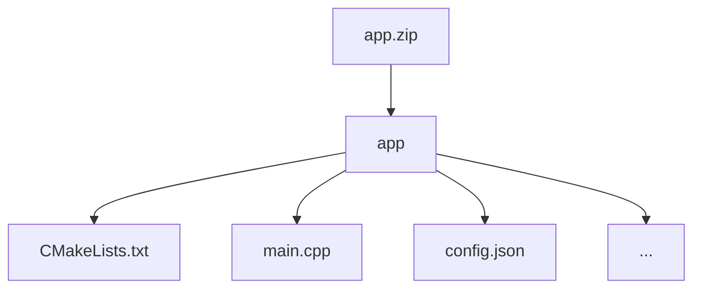

# Encrypted Modulo Operation (MOD)
## Introduction

This challenge is part of the fundamental operations series, a collection of exercises designed to explore the core operations in the encrypted domain. While addition and multiplication are naturally supported in most FHE schemes, nonlinear operations such as modulo present a significant challenge due to their conditional and piecewise nature.

The objective is implement efficient algorithms computing the modulo operation (`c = a mod b`) homomorphically, where both operands are encrypted. 

## Challenge info

1. **Challenge type:** this challenge is a White Box challenge. Participants are required to submit the project with their source code. You can learn more about this and other types of challenges in our [Participation guide](https://fherma.io/how_it_works).
2. **Encryption scheme:** BGV/BFV.
3. **Supported libraries:** [OpenFHE](https://github.com/openfheorg/openfhe-development) — C++, Python, or Rust.
4. **Input**:
    - **Testing data:** a dataset of FHE-encrypted operands
    - **Cryptocontext** provided for FHE operations.
    - **Keys:** public key, multiplication key, Galois keys.
5. **Output**: the output should be an encrypted vector representing the result of the modulo operation `a mod b`.


## Timeline

- Start date: **December 22, 2025**
- Submission deadline: **February 22, 2026 at 23:59 UTC**
- Winner announcement: **March 2, 2026**

## Dataset

- **Input data**: each input sample is a vector consisting of two values `a` and `b`. The dataset includes multiple test case types; examples are shown in the table below.

    | Test Case Type | $a$ | $b$ | Expected $r$ |
    | --- | --- | --- | --- |
    | a = 0 | 0 | 3 | 0 |
    | a % b = 0 | 18 | 6 | 0 |
    | a > b | 6 | 4 | 2 |
    | a < b | 5 | 10 | 5 |
    | a = b | 12 | 12 | 0 |
    | a < 0 | -7 | 4 | 1 |
    | Large numbers | 65536 | 255 | 1 |

    This file is provided for participants to perform local testing: [test_case.json](https://github.com/fairmath/fherma-challenges/blob/main/modulo/tests/test_case.json)
- **Submissions** will be validated on a non-provided testing dataset.

## Encoding technique

During testing, the application will receive an encrypted vector packed within a ciphertext structured as follows:

| $a$ | $b$ | $...$ |
| --- | --- | --- |

The resulting output vector should contain the result of the modulo operation in the first slot:

| $a mod b$ | $...$ |
| --- | --- |

If you need the data to be packaged in a different format, please open an issue on GitHub and we will prepare a new cipher.

## Test environment
### Hardware

- **CPU:** 12 cores
- **RAM:** 54 GB

### Software

The following libraries/packages will be used for generating test case data and for testing solutions:
- **OpenFHE:** v1.2.0 
- **OpenFHE-Python:** v0.8.8

## Submission
### General requirements

1. **Full FHE implementation.** The function must be evaluated entirely under FHE.
2. **No post-processing.** The owner of the encrypted data should receive an encrypted result ready for decryption, with no additional computations required.

### Application requirements

To address this challenge, participants can utilize the [OpenFHE library](https://openfhe.org/) with any of the supported languages: **Rust**, **C++**, or **Python**. For solutions developed in **C++** we expect to see a `CMake` project, with the `CMakeLists.txt` file placed in the project's root directory.

Please adhere to the following format when submitting your solution:
- **File format** — submission should be a ZIP archive.
- **Directory structure**
    - Inside the ZIP archive, ensure there is a directory titled `app`.
    - Within the `app` directory, include your main `CMakeLists.txt` file (or Python- and Rust-related build files) and other source files. Please exclude all unnecessary files related to testing and/or other challenges.



- **Config file** `config.json` to specify execution parameters like `indexes_for_rotation_key`, `mult_depth`, `plaintext_modulus`, `ring_dimension`, etc.

#### Config file

You can use a config file to set parameters for generating a context on the server for testing the solution. An example of such a config is given below.


```json
{
  "indexes_for_rotation_key": [
    1
  ],
  "mult_depth": 5,
  "plaintext_modulus": 65537,
  "ring_dimension": 32768,
  "batch_size": 4096,
  "max_relin_sk_deg": 5,
  "scheme": "BFV" // or BGV
}
```
Config file parameters:
- **indexes_for_rotation_key**: if an application requires the use of a rotation key, this option allows specifying indexes for the rotation key. If the rotation key is not used, it should be an empty array: `indexes_for_rotation_key=[]`.
- **plaintext_modulus**: sets the plaintext modulus, default value is 65537.
- **mult_depth**: multiplicative depth
- **ring_dimension**: ring dimension.
- **max_relin_sk_deg**: this parameter is used to configure `MaxRelinSkDeg`, default value is 3.
- **batch_size**: this parameter allows to set the batch size. Default value is ring_dimension/2.

For openfhe-python based solution you can use a template provided [here](https://github.com/fairmath/fherma-challenges/tree/main/templates).

There are more info on possible config file parameters and their default values in our [Participation guide](https://fherma.io/how_it_works).

### Command-line interface (CLI)

The application must support the following CLI:
- **--sample** [path]: the path to the file where the input ciphertext is located.
- **--output** [path]: the path to the file where the presiction result should be written.
- **--cc** [path]: the path to the serialized crypto context file in **BINARY** form.
- **--key_public** [path]: the path to the public key file.
- **--key_mult** [path]: the path to the evaluation (multiplication) key file.
- **--key_rot** [path]: the path to the rotation key file.


The executable will be run as follows:

```bash
./app --sample data.bin --cc cc.bin --key_public pub.bin --key_mult mult.bin --output result.bin
```

You can validate your solution locally using the [fherma-validator](https://hub.docker.com/r/yashalabinc/fherma-validator) docker image for white box challenges validation. 

## Evaluation criteria

The primary metric for this challenge is accuracy, defined as the percentage of test cases computed correctly. A test case is considered correct if the absolute error is less than a threshold of 0.01. The error is calculated as:

$$
error = \hat y - y
$$

where $\hat y$ is your result and $y$ is the expected value.

The  score prioritizes accuracy but rewards faster solutions when accuracy levels are similar.

## Useful links

- [FHERMA participation guide](https://fherma.io/how_it_works) for more information about FHERMA challenges.
- [OpenFHE](https://github.com/openfheorg/openfhe-development) repository, README, and installation guide.
- [OpenFHE Python](https://github.com/openfheorg/openfhe-python) repository, README, and installation guide.
- [OpenFHE-rs](https://crates.io/crates/openfhe) Rust wrapper, a [walk-through tutorial](https://fherma.io/content/660174e7fce06722c1149a95) and [documentation](https://openfhe-rust-wrapper.readthedocs.io/en/latest/).
- A vast collection of resources [FHE Resources](https://fhe.org/resources), including tutorials and walk-throughs, use-cases and demos.
- [Polycircuit:](https://github.com/fairmath/polycircuit) FHE Components Library
- [FHERMA Content](https://fherma.io/content) page containing descriptions of winning and significant solutions.

## Help

If you have any questions, you can:
- Contact us by email [support@fherma.io](mailto:support@fherma.io)
* Join our [Discord](https://discord.gg/NfhXwyr9M5) server and ask your questions in the [#fherma channel](https://discord.com/channels/1163764915803279360/1167875954392187030). You can also find a team in the [teams channel](https://discord.com/channels/1163764915803279360/1246085439480401930)!
- Use [OpenFHE discourse group](https://openfhe.discourse.group/) for OpenFHE-related questions.

Best of luck to all participants!