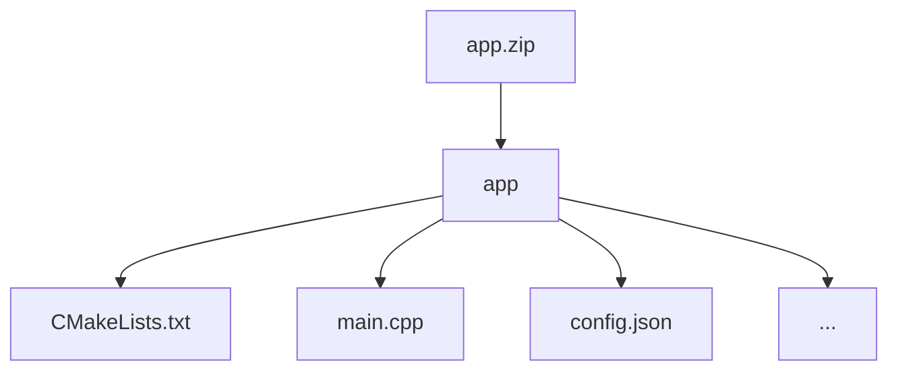

# Private Sentiment Analysis
## Introduction

**Sentiment analysis** is a common task in natural language processing (NLP) that focuses on capturing the polarity of text, typically categorized as positive, negative, or neutral. 

Today companies generate large amounts of unstructured text from emails, chats, social media, and reviews. Sentiment analysis helps automatically understand people’s opinions in this data, which supports better customer service, brand reputation, and business decisions. To protect customer privacy, fully homomorphic encryption (FHE) can be used to run sentiment analysis on encrypted data without ever seeing the original text.

In this challenge, participants are tasked with a **privacy-preserving multiclass classification problem**, labeling encrypted tweet embeddings as **positive**, **negative**, or **neutral**.

### Goals

The goals of this challenge are:
1. **Train a model** using conventional machine learning techniques on the provided unencrypted dataset.
2. **Implement FHE-based inference** — use the trained model to classify input text embeddings under FHE, ensuring that the entire inference occurs under encryption.

## Challenge info

1. **Challenge type:** this challenge is a White Box challenge. Participants are required to submit the project with their source code, including the training script. You can learn more about this and other types of challenges in our [Participation guide](https://fherma.io/how_it_works).
2. **Encryption scheme:** CKKS.
3. **Supported libraries:** [OpenFHE](https://github.com/openfheorg/openfhe-development) — C++, Python, or Rust.
4. **Input**:
    - **Testing data** — a dataset of FHE-encrypted samples for classification.
    - **Cryptocontext** provided for FHE operations.
    - **Keys** — public key, multiplication key, Galois keys.
5. **Output**: encrypted classification result.

## Timeline

- **May 14, 2025** — start date;
- **July 11, 2025, at 23:59 UTC** — submission deadline;
- **July 21, 2025** — prize awarded.


## Datasets
- **Training dataset** consists of embedded tweets from the Tweet Sentiment Extraction dataset used by the MTEB leaderboard, along with the corresponding sentiment labels: [dataset.parquet](https://github.com/fairmath/fherma-challenges/blob/main/sentiment-analysis/data/dataset.parquet).
The labels are assigned as follows: 0 for negative, 1 for neutral, and 2 for positive.
- **Usage:** Feel free to split the provided dataset into training and validation sets.
- **Submissions** will be validated on a non-provided **testing dataset**.

**During model training, only the dataset provided above is allowed to be used.**

## Encoding technique
During testing, the application receives an encrypted embedding as input. By default, we pack the input vector `X` into a ciphertext, where the `i`th slot corresponds to the `i`th dimension of the given embedding:

| x0 | x1 | ... | x766 | x767 | ... | 
|--------|--------|--------|--------|--------|--------|

The outcome of the computation is determined by the first three slots of the resulting ciphertext. If the input tweet embedding belongs to class `j`, then the maximum value among these three slots must appear in slot `j`. For example, if the input is classified as negative (class 2), the correct result may appear as follows:

| 0.28 | 0.34 | 0.76 | ... |
| -------- |--------|--------|--------|

If you need the data to be packaged in a different format, please open an issue on [GitHub](https://github.com/fairmath/fherma-challenges) and we will prepare a new cipher.

## Test environment
### Hardware

- **CPU:** 12 cores
- **RAM:** 54 GB

### Software

The following libraries/packages will be used for generating test case data and for testing solutions:
- **OpenFHE:** v1.2.4 
- **OpenFHE-Python:** v0.8.10

## Submission
### General requirements

1. **Full FHE implementation.** The decision function and any other functions, e.g. activation functions, must be executed entirely under FHE.
2. **No post-processing.** The owner of the encrypted data should receive an encrypted classification result ready for decryption, with no additional computations required.
3. **Code**. Both the training code and the inference code must be included.

### Application requirements

To address this challenge, participants can utilize the [OpenFHE library](https://openfhe.org/) with any of the supported languages: **Rust**, **C++**, or **Python**. For solutions developed in **C++** we expect to see a `CMake` project, with the `CMakeLists.txt` file placed in the project's root directory.

Please adhere to the following format when submitting your solution:
- **File format** — submission should be a ZIP archive.
- **Directory structure**
    - Inside the ZIP archive, ensure there is a directory titled `app`.
    - Within the `app` directory, include your main `CMakeLists.txt` file (or Python- and Rust-related build files) and other source files. Please exclude all unnecessary files related to testing and/or other challenges.
Please note that the compiled binary will run separately from the source code, which means the application won’t have access to any files in the source-code directory.



- **Config file** `config.json` to specify execution parameters like `indexes_for_rotation_key`, `mult_depth`, `plaintext_modulus`, `ring_dimension`, etc.

#### Config file

You can use a config file to set parameters for generating a context on the server for testing the solution. An example of such a config is given below.


```json
{
    "indexes_for_rotation_key": [
        1
    ],
    "mult_depth": 29,
    "ring_dimension": 131072,
    "scale_mod_size": 59,
    "first_mod_size": 60,
    "batch_size": 65536,
    "enable_bootstrapping": false,
    "levels_available_after_bootstrap": 10,
    "level_budget": [4,4]
}
```

There are more info on possible config file parameters and their default values in our [Participation guide](https://fherma.io/how_it_works).

### Command-line interface (CLI)

The application must support the following CLI:
- **--tx** [path]: the path to the file where the input ciphertext is located.
- **--output** [path]: the path to the file where the classification result should be written.
- **--cc** [path]: the path to the serialized crypto context file in **BINARY** form.
- **--key_public** [path]: the path to the public key file.
- **--key_mult** [path]: the path to the evaluation (multiplication) key file.
- **--key_rot** [path]: the path to the rotation key file.


The executable will be run as follows:

```bash
./app --tx data.bin --cc cc.bin --key_public pub.bin --key_mult mult.bin --output result.bin
```
## Validating locally

You can validate your solution locally using the [fherma-validator](https://hub.docker.com/r/yashalabinc/fherma-validator) docker image for white box challenges validation. To pull the image run the following comand:

```bash
docker pull yashalabinc/fherma-validator
```
### Example Setup
If your local folder containing the solution is located at `~/user/tmp/sentiment-analysis/app`, use the following command to run the validator:

```bash
docker run -ti -v ~/user/tmp/sentiment-analysis:/fherma yashalabinc/fherma-validator --project-folder=/fherma/app --testcase=/fherma/tests/test_case.json
```
Here is a breakdown of the command:
- `-v ~/user/tmp/sentiment-analysis:/fherma`: maps your local directory to the `/fherma` directory in the Docker container.
- `--project-folder=/fherma/app`: specifies the folder where your solution is located.
- `--testcase=/fherma/tests/test_case.json`: points to the JSON file containing the test case for validation. Ensure the path to `test_case.json` is correct and matches your directory structure. You can find the test case in [our GitHub repository](https://github.com/fairmath/fherma-challenges/tree/main/sentiment-analysis/tests/test_case.json)

After validation, a `result.json` file will be generated in your project folder.

## Evaluation criteria

Submissions will be evaluated on the non-provided dataset and scored with the following criteria:

1. **Weighted F1**: the average of per-class F1 scores, where each score is weighted according to the number of true instances of that class in the dataset.
2. **Execution time:** the average time taken to classify each sample.

## Scorring & awards

Two winners will be chosen in this challenge:

1. **Fastest solution**: the solution with minimum execution time with more than 70% **accuracy**.
2. **Most accurate solution**: the solution with the highest weighted f1 score.

The winner in each category will be awarded **$2000**.

One participant can be the winner in both categories. Total prize fund is **$4000**.

## Challenge committee
- [Gurgen Arakelov](https://www.linkedin.com/in/gurgen-arakelov-943172b9/), Fair Math
- [Sergey Gomenyuk](https://www.linkedin.com/in/sergey-gomenyuk-7a355a42/), Fair Math
- [Valentina Kononova](https://www.linkedin.com/in/valentina-kononova-a9a23b180/), Fair Math

## Useful links

- [FHERMA participation guide](https://fherma.io/how_it_works)—more about FHERMA challenges.
- [OpenFHE](https://github.com/openfheorg/openfhe-development) repository, README, and installation guide.
- [OpenFHE Python](https://github.com/openfheorg/openfhe-python) repository, README, and installation guide.
- [OpenFHE-rs](https://crates.io/crates/openfhe) Rust wrapper, a [walk-through tutorial](https://fherma.io/content/660174e7fce06722c1149a95) and [documentation](https://openfhe-rust-wrapper.readthedocs.io/en/latest/).
- A vast collection of resources [FHE Resources](https://fhe.org/resources), including tutorials and walk-throughs, use-cases and demos.
- [Polycircuit](https://github.com/fairmath/polycircuit) repository with FHE Components Library
- [FHERMA Content](https://fherma.io/content) page containing descriptions of winning and significant solutions.

## Help

If you have any questions, you can:
- Contact us by email [support@fherma.io](mailto:support@fherma.io)
- Join our [Discord](https://discord.gg/NfhXwyr9M5) server and ask your questions in the [#fherma channel](https://discord.com/channels/1163764915803279360/1167875954392187030). You can also find a team in the [teams channel](https://discord.com/channels/1163764915803279360/1246085439480401930)
- Use [OpenFHE discourse group](https://openfhe.discourse.group/) for OpenFHE-related questions.

Best of luck to all participants!
