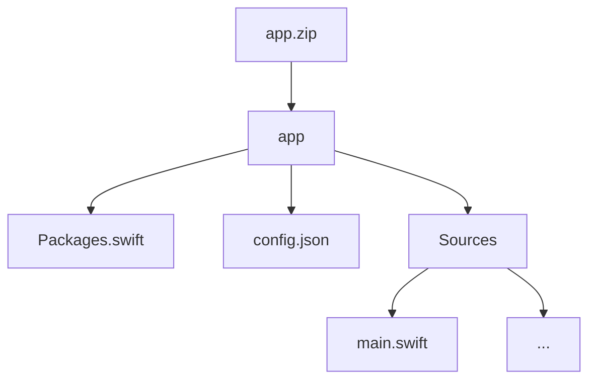

# Set Membership

## Introduction

The set membership problem is a fundamental task in secure computing, where two or more parties wish to determine if elements of one set exist within another without revealing their individual elements. This challenge invites participants to implement a secure set membership protocol using Fully Homomorphic Encryption (FHE). The goal is to check the presence of elements from one encrypted input vector in another encrypted input vector while maintaining privacy.

### Goals

The goals of this challenge are:

1. Securely check the presence of elements of one encrypted vector within another encrypted vector.
2. Return an encrypted binary vector indicating membership for each element.

## Challenge Info

1. **Challenge type:** White Box challenge. Participants are required to submit their project with source code. More details can be found in our [Participation guide](https://fherma.io/how_it_works).
2. **Encryption scheme:** BFV.
3. **Supported libraries:**  [Apple Swift-Homomorphic-Encryption](https://github.com/apple/swift-homomorphic-encryption).
4. **Input:**
   - **Testing data** — two encrypted input vectors, each containing 255 elements.
   - **Cryptocontext** for FHE operations.
   - **Keys** — public key, multiplication key, Galois keys.
5. **Output:** The output should be an encrypted binary vector of length 255. Each position in the output vector should contain `1` if the corresponding element of the first vector exists anywhere in the second vector, and `0` otherwise.

## Timeline

- **Jan 24, 2025** — start date.
- **April 24, 2025, at 23:59 UTC** — submission deadline.
- **April 15, 2025** — prize awarded.

## Test input

- **Input vectors:** Each input vector contains 255 randomly generated integers within the range [1, 2048].
- **Output vector:** A binary vector of length 255 indicating presence.

### Examples

#### Example 1

**Input:**

- Vector 1: `[12, 45, 78, 200, 512, 1024, 1500, 1800, 2048, ...]`
- Vector 2: `[7, 12, 45, 512, 1500, 99, 2000, 1750, ...]`

**Output:**

- Result vector: `[1, 1, 0, 0, 1, 0, 1, 0, 0, ...]`

#### Example 2

**Input:**

- Vector 1: `[100, 200, 300, 400, 500, 600, 700, 800, 900, ...]`
- Vector 2: `[50, 150, 250, 350, 450, 550, 650, 750, 850, ...]`

**Output:**

- Result vector: `[0, 0, 0, 0, 0, 0, 0, 0, 0, ...]`

## Test Environment

### Hardware

- **CPU:** 16 cores
- **RAM:** 64 GB

### Software

The following libraries/packages will be used for generating test case data and testing solutions:

- **swift-homomorphic-encryption** latest version

## Submission

### Application Requirements

Participants must utilize the [swift-homomorphic-encryption library](https://github.com/apple/swift-homomorphic-encryption) in **Swift**.

Please adhere to the following format when submitting your solution:

- **File format:** ZIP archive.
- **Directory structure:**
  - A directory titled `app` should contain the source files and required configuration files.


`Sources` should contain `main.swift` with all nececcasry files for the solution.
Make sure `Pakcages.swift` includes `swift-homomorphic-encryption` dependency for executable.
Build line:
```bash
$ swift build --configuration=release
```

### Command-Line Interface (CLI)

The application must support the following CLI:

- **--input1** [path]: path to the first encrypted vector file.
- **--input2** [path]: path to the second encrypted vector file.
- **--output** [path]: path to the output file.
- **--config** [path]: path to the config json file.
- **--key\_eval** [path]: path to the evaluation key set file.

Example execution:

```bash
$ ./app --input1 data1 --input2 data2 --configc config.json --key_eval eval_keys.json --output result
```

### Config file
You can use a config file to set parameters for generating keys on the server for testing the solution. An example of such a config and detailed description of each parameter is given below.
```
{
    "scheme": "BFV",
    "indexes_for_rotation_key": [1,2,3,4,5],
    "poly_degree": 8192,
    "plaintext_modulus": 557057, 
    "coefficient_moduli": [268369921, 1152921504606830593, 1152921504606748673]    
}
```
- **scheme** - only BFV is supported by Apple swift-homomorphic-encryption library
- **indexes_for_rotation_key** - indexes to generate rortation keys.
- **poly_degree** - Polynomial modulus degree *N*.
- **plaintext_modulus** - Plaintext modulus. Must be prime and less than all moduli coefficients.
- **coefficient_moduli** - List of coefficient moduli *q = q<sub>0</sub> * ... * q<sub>L-1</sub>* - moduli coefficients
See [the link](https://github.com/apple/swift-homomorphic-encryption/blob/main/Sources/HomomorphicEncryption/EncryptionParameters.swift) for better understanding parameters in Apple swift homomorphic encryption library. Also you can find preset parameters there.

Parameters should satisfy 128 bit post quantum security


## Evaluation Criteria

Submissions will be evaluated based on:

1. **Accuracy:** Correctness of the set membership check.
2. **Execution time:** Average time to process the input vectors.

Accuracy is the primary evaluation metric; execution time will be considered in case of ties.

## Scoring & Awards

The prize fund of **\$4000** will be awarded to the most accurate and fastest solution.

## Challenge Committee
- **Gurgen Arakelov**, Fair Math
- **Sergey Gomenyuk**, Fair Math
- **Daria Pianykh**, Fair Math
- **Valentina Kononova**, Fair Math

## Useful Links

- [FHERMA participation guide](https://fherma.io/how_it_works)
- [swift-homomorphic-encryption](https://github.com/apple/swift-homomorphic-encryption)

## Help

If you have questions:

- Contact us via [support@fherma.io](mailto\:support@fherma.io)
- Join our [Discord](https://discord.gg/NfhXwyr9M5) and ask in the `#fherma` channel.

Best of luck to all participants!

