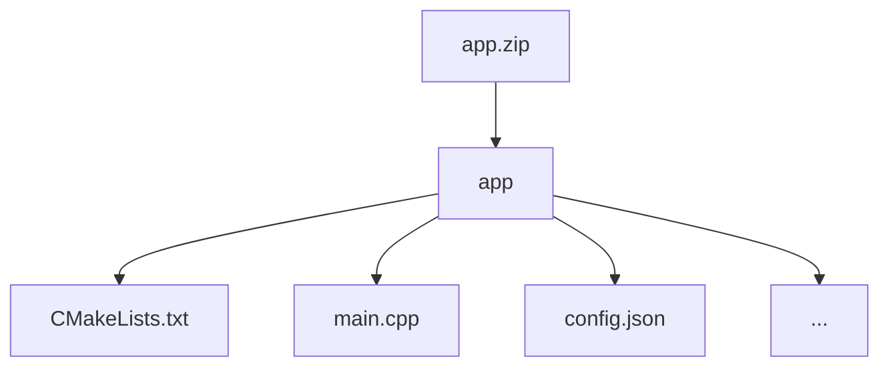

# Softmax Function

## Introduction

This challenge is part of a series focusing on activation functions used in various neural network architectures: [ReLU](https://fherma.io/challenges/6542c282100761da3b545c3e/overview), [Logistic (sigmoid)](https://fherma.io/challenges/652bf648485c878710fd0208/overview), [GELU](https://fherma.io/challenges/683eaf48eed44a699f640a92/overview).

To recap, activation functions introduce non-linearity into neural networks, enabling them to learn complex patterns in data. In addition to ReLU and sigmoid, other commonly used activation functions include tanh, GELU, SiLU, Swish, Softmax, and more.

This challenge focuses on the Softmax function, which is often used as the last activation function of a neural network to normalize its output to a probability distribution over predicted output classes. It is also used in the attention mechanism of [transformers](https://arxiv.org/pdf/1706.03762) to convert attention scores into probabilities, guiding how much focus the model places on each input token.

Softmax is defined as follows:

$$
\text{Softmax}(z_i) = \frac{e^{z_i}}{\sum_{j=1}^{K} e^{z_j}}
$$

Where:

- $z = [z_1, z_2, ..., z_n]$ is the input vector,
- $n$ represents the size of the input vector (e.g., the number of class logits in classification, vocabulary size in language models, or the number of input sequence tokens in transformers).

The goal of this challenge is to implement an algorithm that evaluates the Softmax function on encrypted data.


## Challenge info

1. **Challenge type:** this challenge is a White Box challenge. Participants are required to submit the project with their source code, including the training script. You can learn more about this and other types of challenges in our [Participation guide](https://fherma.io/how_it_works).
2. **Encryption scheme:** CKKS.
3. **Supported libraries:** [OpenFHE](https://github.com/openfheorg/openfhe-development) — C++, Python, or Rust.
4. **Input**:
    - **Testing data:** a dataset of FHE-encrypted samples
    - **Cryptocontext** provided for FHE operations.
    - **Keys:** public key, multiplication key, Galois keys.
5. **Output**: encrypted vector representing `Softmax(X)`


## Timeline

- Start date: **August 11, 2025**
- Submission deadline: **October 12, 2025, at 23:59 UTC**
- Winner announcement: **October 21, 2025**

## Dataset

- **Input data** is a 4096-dimensional vector, randomly generated within the range [-7, 7] and normally distributed. You can find an example [here](https://github.com/fairmath/fherma-challenges/blob/main/softmax-function/tests/test_case.json)
- **Submissions** will be validated on a non-provided testing dataset.

## Encoding technique

During testing, the application will receive an encrypted vector packed within a ciphertext structured as follows:

| $x_0$ | $x_1$ | $x_2$ | $x_3$ | … | $x_{4095}$ |
| --- | --- | --- | --- | --- | --- |

The resulting vector should have the same structure, representing `Softmax(X)` evaluated on the input vector.

If you need the data to be packaged in a different format, please open an issue on GitHub and we will prepare a new cipher.

## Test environment
### Hardware

- **CPU:** 12 cores
- **RAM:** 54 GB

### Software

The following libraries/packages will be used for generating test case data and for testing solutions:
- **OpenFHE:** v1.2.0 
- **OpenFHE-Python:** v0.8.8

## Submission
### General requirements

1. **Full FHE implementation.** The function must be evaluated entirely under FHE.
2. **No post-processing.** The owner of the encrypted data should receive an encrypted result ready for decryption, with no additional computations required.

### Application requirements

To address this challenge, participants can utilize the [OpenFHE library](https://openfhe.org/) with any of the supported languages: **Rust**, **C++**, or **Python**. For solutions developed in **C++** we expect to see a `CMake` project, with the `CMakeLists.txt` file placed in the project's root directory.

Please adhere to the following format when submitting your solution:
- **File format** — submission should be a ZIP archive.
- **Directory structure**
    - Inside the ZIP archive, ensure there is a directory titled `app`.
    - Within the `app` directory, include your main `CMakeLists.txt` file (or Python- and Rust-related build files) and other source files. Please exclude all unnecessary files related to testing and/or other challenges.



- **Config file** `config.json` to specify execution parameters like `indexes_for_rotation_key`, `mult_depth`, `plaintext_modulus`, `ring_dimension`, etc.

#### Config file

You can use a config file to set parameters for generating a context on the server for testing the solution. An example of such a config is given below.


```json
{
    "indexes_for_rotation_key": [
        1
    ],
    "mult_depth": 29,
    "ring_dimension": 131072,
    "scale_mod_size": 59,
    "first_mod_size": 60,
    "batch_size": 65536,
    "enable_bootstrapping": false,
    "levels_available_after_bootstrap": 10,
    "level_budget": [4,4]
}
```
For openfhe-python based solution you can use a template provided [here](https://github.com/fairmath/fherma-challenges/tree/main/templates).

There are more info on possible config file parameters and their default values in our [Participation guide](https://fherma.io/how_it_works).

### Command-line interface (CLI)

The application must support the following CLI:
- **--sample** [path]: the path to the file where the input ciphertext is located.
- **--output** [path]: the path to the file where the presiction result should be written.
- **--cc** [path]: the path to the serialized crypto context file in **BINARY** form.
- **--key_public** [path]: the path to the public key file.
- **--key_mult** [path]: the path to the evaluation (multiplication) key file.
- **--key_rot** [path]: the path to the rotation key file.


The executable will be run as follows:

```bash
./app --sample data.bin --cc cc.bin --key_public pub.bin --key_mult mult.bin --output result.bin
```

You can validate your solution locally using the [fherma-validator](https://hub.docker.com/r/yashalabinc/fherma-validator) docker image for white box challenges validation. 

## Evaluation criteria

The primary metric for this challenge is accuracy, defined as the percentage of slots computed correctly. A slot is considered correct if the error is less than the threshold of 0.001. The error for each slot is calculated as:

$$
error = \hat y - y
$$

where $\hat y$ is your result and $y$ is the expected value.

Execution time will also be considered, and faster solutions will be favored when accuracy levels are similar.

## Awards

In this challenge, the solution with the highest accuracy will be awarded **$2000**.

## Useful links

- [FHERMA participation guide](https://fherma.io/how_it_works) for more information about FHERMA challenges.
- [OpenFHE](https://github.com/openfheorg/openfhe-development) repository, README, and installation guide.
- [OpenFHE Python](https://github.com/openfheorg/openfhe-python) repository, README, and installation guide.
- [OpenFHE-rs](https://crates.io/crates/openfhe) Rust wrapper, a [walk-through tutorial](https://fherma.io/content/660174e7fce06722c1149a95) and [documentation](https://openfhe-rust-wrapper.readthedocs.io/en/latest/).
- A vast collection of resources [FHE Resources](https://fhe.org/resources), including tutorials and walk-throughs, use-cases and demos.
- [Polycircuit:](https://github.com/fairmath/polycircuit) FHE Components Library
- [FHERMA Content](https://fherma.io/content) page containing descriptions of winning and significant solutions.

## Help

If you have any questions, you can:
- Contact us by email [support@fherma.io](mailto:support@fherma.io)
* Join our [Discord](https://discord.gg/NfhXwyr9M5) server and ask your questions in the [#fherma channel](https://discord.com/channels/1163764915803279360/1167875954392187030). You can also find a team in the [teams channel](https://discord.com/channels/1163764915803279360/1246085439480401930)!
- Use [OpenFHE discourse group](https://openfhe.discourse.group/) for OpenFHE-related questions.

Best of luck to all participants!
