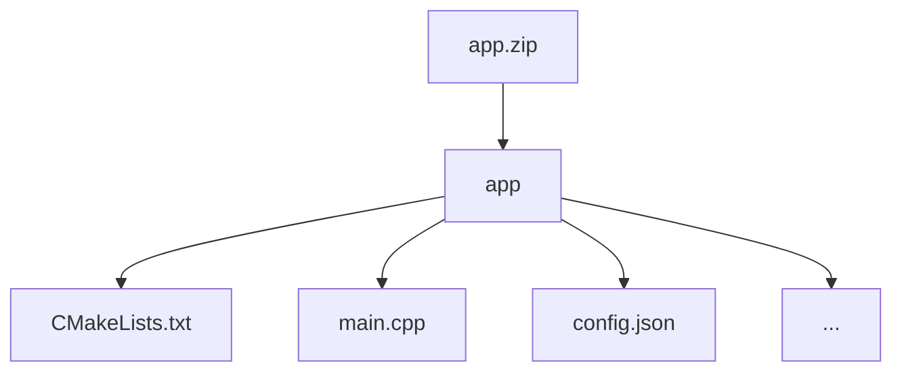

*The winner will have the opportunity to co-create the next challenge alongside the FHERMA Organizing Committee, joining the core team as a Guest Challenge Designer for the next edition.*

# Singular Value Decomposition (SVD) under FHE

## Introduction

**Singular Value Decomposition (SVD)** is a cornerstone of data analysis, with applications ranging from dimensionality reduction and recommender systems to image compression and latent semantic analysis. However, performing SVD directly on encrypted data expands the possible use cases when the data privacy is crucial. 

This challenge invites participants to implement an efficient, privacy-preserving SVD algorithm on encrypted data in the context of image compression.

## Objectives

Develop and implement an algorithm that performs SVD on an encrypted matrix using Fully Homomorphic Encryption.

Given a matrix $A_{mxn}$, encrypted element-wise under an FHE, participants must compute (or approximate) the matrices $U_{m\times m}$,$\Sigma_{m\times n}$, and $V_{n\times n}$ such that:

$$
A \approx U \Sigma V^T
$$

For a more compact output, the resulting ciphertext should contain the top 30 components, specifically the matrices $U_{m\times 30}$, $V_{30\times n}$, and the 30 largest singular values. The value of 30 was selected as the optimal number of singular values, capturing approximately 99% of the total variance in the testing dataset.


## Challenge info

1. **Challenge type:** this challenge is a White Box challenge. Participants are required to submit the project with their source code, including the training script. You can learn more about this and other types of challenges in our [Participation guide](https://fherma.io/how_it_works).
2. **Encryption scheme:** CKKS.
3. **Supported libraries:** [OpenFHE](https://github.com/openfheorg/openfhe-development) — C++, Python, or Rust.
4. **Input**:
    - **Testing data:** a dataset of FHE-encrypted samples
    - **Cryptocontext** provided for FHE operations.
    - **Keys:** public key, multiplication key, Galois keys.
5. **Output**: the output should be an encrypted vector representing the truncated SVD components of the input 170х256 image:
    - the right singular vectors matrix $U_{170\times 30}$, 
    - the top 30 singular values $s[:30]$, 
    - the left singular vectors matrix $V^T_{30\times 256}$.
    
    Together, these components correspond to the truncated reconstruction:
    $$
    A_{approx} = U_{170\times 30} \mathrm{diag}(s[:30]) V^T_{30\times 256}
    $$


## Timeline

- Start date: **November 5, 2025**
- Submission deadline: **December 22, 2025 at 23:59 UTC**
- Winner announcement: **December 29, 2025**

## Dataset

- **Input data**: each input sample is a 43520-dimensional vector representing a grayscale image of size 170х256. The dataset is composed of downsampled images from the [Berkeley Segmentation Dataset 500 (BSDS500)](https://www2.eecs.berkeley.edu/Research/Projects/CS/vision/bsds/). 

    You can find an example [here](https://github.com/fairmath/fherma-challenges/blob/main/svd/tests/test_case.json)
- **Submissions** will be validated on a non-provided testing dataset.

## Encoding technique

During testing, the application will receive an encrypted vector packed within a ciphertext structured as follows:

| $x_0$ | $x_1$ | $x_2$ | $x_3$ | … | $x_{43519}$ |
| --- | --- | --- | --- | --- | --- |

The resulting output vector should concatenate all truncated SVD components into a single ciphertext:

| $U_{0,0}$ | $U_{0,1}$ | $...$ | $U_{170,30}$ | $s_{0}$ |... | $s_{30}$ | $V^T_{0,0}$ |$V^T_{0,1}$ | $...$ |$V^T_{30,256}$ |
| --- | --- | --- | --- | --- | --- | --- | --- | --- | --- | --- |

If you need the data to be packaged in a different format, please open an issue on GitHub and we will prepare a new cipher.

## Test environment
### Hardware

- **CPU:** 12 cores
- **RAM:** 54 GB

### Software

The following libraries/packages will be used for generating test case data and for testing solutions:
- **OpenFHE:** v1.2.0 
- **OpenFHE-Python:** v0.8.8

## Submission
### General requirements

1. **Full FHE implementation.** The function must be evaluated entirely under FHE.
2. **No post-processing.** The owner of the encrypted data should receive an encrypted result ready for decryption, with no additional computations required.

### Application requirements

To address this challenge, participants can utilize the [OpenFHE library](https://openfhe.org/) with any of the supported languages: **Rust**, **C++**, or **Python**. For solutions developed in **C++** we expect to see a `CMake` project, with the `CMakeLists.txt` file placed in the project's root directory.

Please adhere to the following format when submitting your solution:
- **File format** — submission should be a ZIP archive.
- **Directory structure**
    - Inside the ZIP archive, ensure there is a directory titled `app`.
    - Within the `app` directory, include your main `CMakeLists.txt` file (or Python- and Rust-related build files) and other source files. Please exclude all unnecessary files related to testing and/or other challenges.



- **Config file** `config.json` to specify execution parameters like `indexes_for_rotation_key`, `mult_depth`, `plaintext_modulus`, `ring_dimension`, etc.

#### Config file

You can use a config file to set parameters for generating a context on the server for testing the solution. An example of such a config is given below.


```json
{
    "indexes_for_rotation_key": [
        1
    ],
    "mult_depth": 29,
    "ring_dimension": 131072,
    "scale_mod_size": 59,
    "first_mod_size": 60,
    "batch_size": 65536,
    "enable_bootstrapping": false,
    "levels_available_after_bootstrap": 10,
    "level_budget": [4,4]
}
```
For openfhe-python based solution you can use a template provided [here](https://github.com/fairmath/fherma-challenges/tree/main/templates).

There are more info on possible config file parameters and their default values in our [Participation guide](https://fherma.io/how_it_works).

### Command-line interface (CLI)

The application must support the following CLI:
- **--sample** [path]: the path to the file where the input ciphertext is located.
- **--output** [path]: the path to the file where the presiction result should be written.
- **--cc** [path]: the path to the serialized crypto context file in **BINARY** form.
- **--key_public** [path]: the path to the public key file.
- **--key_mult** [path]: the path to the evaluation (multiplication) key file.
- **--key_rot** [path]: the path to the rotation key file.


The executable will be run as follows:

```bash
./app --sample data.bin --cc cc.bin --key_public pub.bin --key_mult mult.bin --output result.bin
```

You can validate your solution locally using the [fherma-validator](https://hub.docker.com/r/yashalabinc/fherma-validator) docker image for white box challenges validation. 

## Evaluation criteria

Submissions will be evaluated on the non-provided dataset and scored based on the following criteria:

1. **Frobenius Similarity**
    
    $$
    FS = 1 - \max(\frac{\| A - U \Sigma V^T \|_F}{    \| A \|_F},1)
    $$
    
    where $\|.\|_F$ denotes the Frobenius norm of a matrix. 
    This metric measures the relative reconstruction quality of the submitted solution, with 1 indicating perfect reconstruction and 0 indicating poor reconstruction.
    
2. **Explained Variance**
    
    $$
    EV = \frac{\sum_{i=1}^{30} s_i^2}{\sum_{i=1}^k s_i^2}
    $$
    
    where $s_i$ are the singular values of $A_{m\times n}$ and $k=\min(n,m)$. This metric quantifies the fraction of total variance captured by the first 30 singular values. 
    

The overall accuracy score is computed as the average of Frobenius similarity and explained variance

The  score prioritizes accuracy but rewards faster solutions when accuracy levels are similar.

## Useful links

- [FHERMA participation guide](https://fherma.io/how_it_works) for more information about FHERMA challenges.
- [OpenFHE](https://github.com/openfheorg/openfhe-development) repository, README, and installation guide.
- [OpenFHE Python](https://github.com/openfheorg/openfhe-python) repository, README, and installation guide.
- [OpenFHE-rs](https://crates.io/crates/openfhe) Rust wrapper, a [walk-through tutorial](https://fherma.io/content/660174e7fce06722c1149a95) and [documentation](https://openfhe-rust-wrapper.readthedocs.io/en/latest/).
- A vast collection of resources [FHE Resources](https://fhe.org/resources), including tutorials and walk-throughs, use-cases and demos.
- [Polycircuit:](https://github.com/fairmath/polycircuit) FHE Components Library
- [FHERMA Content](https://fherma.io/content) page containing descriptions of winning and significant solutions.

## Help

If you have any questions, you can:
- Contact us by email [support@fherma.io](mailto:support@fherma.io)
* Join our [Discord](https://discord.gg/NfhXwyr9M5) server and ask your questions in the [#fherma channel](https://discord.com/channels/1163764915803279360/1167875954392187030). You can also find a team in the [teams channel](https://discord.com/channels/1163764915803279360/1246085439480401930)!
- Use [OpenFHE discourse group](https://openfhe.discourse.group/) for OpenFHE-related questions.

Best of luck to all participants!