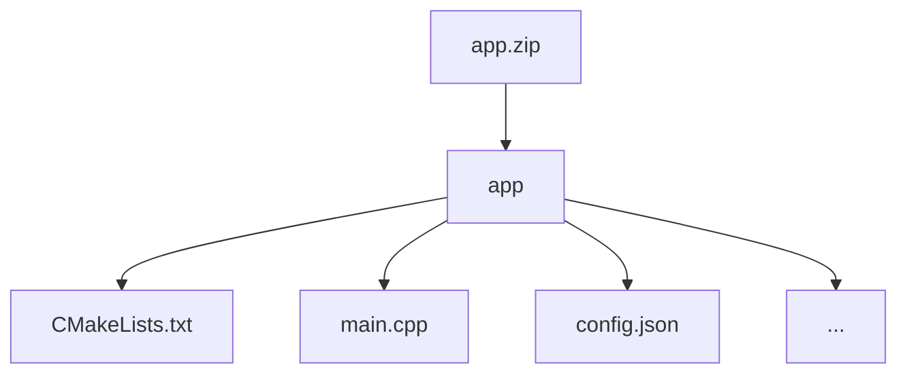

# Privacy-Preserving Singular Value Decomposition (SVD) under FHE

## Introduction

Singular Value Decomposition (SVD) is a cornerstone of data analysis, with applications ranging from dimensionality reduction and recommender systems to image compression and latent semantic analysis. However, performing SVD directly on encrypted data expands the possible use cases when the data privacy is crucial. 

This challenge invites participants to tackle key obstacles (such as high computational cost, noise growth, and limited support for certain operations) and to implement an efficient, privacy-preserving SVD algorithm on encrypted data.

## Objectives

Develop and implement an algorithm that performs **Singular Value Decomposition (SVD)** on an **encrypted matrix** using **Fully Homomorphic Encryption**.

Given a matrix $A_{mxn}$, encrypted element-wise under an FHE scheme, participants must compute (or approximate) the matrices $U_{mxm}$,$\Sigma_{mxn}$, and $V_{nxn}$ such that:

$$
A \approx U \Sigma V^T
$$

## Use Cases

**Privacy-preserving recommendation systems**

Many recommendation algorithms rely on SVD to reconstruct user-item rating matrices and predict preferences. Performing SVD on encrypted data allows these systems to generate personalized recommendations without exposing individual user ratings, preserving privacy while maintaining functionality.

**Encrypted image processing**

SVD is widely used in image compression and recognition tasks. By applying SVD to encrypted images, it is possible to compress, analyze, or perform face recognition on sensitive images without ever revealing the underlying visual data.


**Dimensionality reduction via PCA**

PCA often uses SVD to compute the principal components of a dataset. In many cases, the first few components capture a large portion of the total variance, allowing a substantial reduction in the number of features while still revealing patterns, simplifying the data, or supporting clustering. Performing PCA on encrypted data—for instance, in genomic analysis—enables researchers to extract meaningful insights without exposing individuals’ sensitive information.

## **SVD Algorithm**

**Input:** Matrix $ \mathrm{A}_{m \times n} ​$ 

**Output:** Matrices `$\mathrm{U}_{m \times m}​$` , `$\mathrm{\Sigma}_{m \times n}​$`, `$\mathrm{V}^T_{n \times n}​$`  such that `$\mathrm{A} = ​\mathrm{U} \Sigma \mathrm{V}^\mathrm{T}$`

**Steps:**

1. **Compute** `$\mathrm{A}^\mathrm{T}\mathrm{A}$` (size ${n \times n}$) 
2. **Compute eigenvalues  of** `$\mathrm{A}^\mathrm{T}\mathrm{A}$` **and sort these in descending order**
    - Solve characteristic equations to find eigenvalues
    - Arrange `$\lambda_i$` in descending order
3. **Compute singular values**
    - Square roots eigenvalues to obtain the singular values of A: `$\sigma_i = \sqrt{\lambda_i}$`
4. **Construct diagonal matrix** `$\Sigma$`
    - Place singular values `$\sigma_i$` on the diagonal of `$\Sigma_{m \times n}$`
5. Compute eigenvectors of `$\mathrm{A}^\mathrm{T}\mathrm{A}$:`
    - Use  `$\det(\mathrm{A}^\mathrm{T}\mathrm{A} - \lambda \mathrm{I}) = 0$`
6. **Compute right singular vectors** `$\mathrm{V}$`
    1. Collect  $v_i$ as columns of `$\mathrm{V}$`
7. **Compute left singular vectors** `$\mathrm{U}$`
    - For each non-zero `$\sigma_i$`: `$u_i = \frac{1}{\sigma_i}\mathrm{A}v_i$`
    - Collect  $u_i$ as columns of `$\mathrm{U}$`
8. **Verify decomposition**
    - Check that `$\mathrm{A} \approx ​\mathrm{U} \Sigma \mathrm{V}^\mathrm{T}$`

<aside>
Consider implementing an approximate SVD using iterative methods (e.g., [power iteration](https://en.wikipedia.org/wiki/Power_iteration) or randomized SVD), which may be better suited for fully homomorphic encryption.
</aside>

## Evaluation criteria

Submissions will be evaluated on the non-provided dataset and scored based on the following criteria:

1. **Accuracy:** Frobenius norm

The decrypted output should reconstruct the matrix `A` with acceptable approximation error:

$$
\frac{\| A - U \Sigma V^T \|_F}{    \| A \|_F} < \epsilon
$$

where $\epsilon$ < 0.02 and `F` denotes the Frobenius norm of a matrix, i.e., the square root of the sum of the squares of all its entries.

1. **Execution time:** the average time taken to process a test case.

The score prioritizes accuracy (measured by the F1 score) but rewards faster solutions when accuracy levels are similar.

## Test environment
### Hardware

- **CPU:** 12 cores
- **RAM:** 54 GB

### Software

The following libraries/packages will be used for generating test case data and for testing solutions:
- **OpenFHE:** v1.2.0 
- **OpenFHE-Python:** v0.8.8

## Submission
### General requirements

1. **Full FHE implementation.** The function must be evaluated entirely under FHE.
2. **No post-processing.** The owner of the encrypted data should receive an encrypted result ready for decryption, with no additional computations required.

### Application requirements

To address this challenge, participants can utilize the [OpenFHE library](https://openfhe.org/) with any of the supported languages: **Rust**, **C++**, or **Python**. For solutions developed in **C++** we expect to see a `CMake` project, with the `CMakeLists.txt` file placed in the project's root directory.

Please adhere to the following format when submitting your solution:
- **File format** — submission should be a ZIP archive.
- **Directory structure**
    - Inside the ZIP archive, ensure there is a directory titled `app`.
    - Within the `app` directory, include your main `CMakeLists.txt` file (or Python- and Rust-related build files) and other source files. Please exclude all unnecessary files related to testing and/or other challenges.



- **Config file** `config.json` to specify execution parameters like `indexes_for_rotation_key`, `mult_depth`, `plaintext_modulus`, `ring_dimension`, etc.

#### Config file

You can use a config file to set parameters for generating a context on the server for testing the solution. An example of such a config is given below.


```json
{
    "indexes_for_rotation_key": [
        1
    ],
    "mult_depth": 29,
    "ring_dimension": 131072,
    "scale_mod_size": 59,
    "first_mod_size": 60,
    "batch_size": 65536,
    "enable_bootstrapping": false,
    "levels_available_after_bootstrap": 10,
    "level_budget": [4,4]
}
```
For openfhe-python based solution you can use a template provided [here](https://github.com/fairmath/fherma-challenges/tree/main/templates).

There are more info on possible config file parameters and their default values in our [Participation guide](https://fherma.io/how_it_works).

### Command-line interface (CLI)

The application must support the following CLI:
- **--sample** [path]: the path to the file where the input ciphertext is located.
- **--output** [path]: the path to the file where the presiction result should be written.
- **--cc** [path]: the path to the serialized crypto context file in **BINARY** form.
- **--key_public** [path]: the path to the public key file.
- **--key_mult** [path]: the path to the evaluation (multiplication) key file.
- **--key_rot** [path]: the path to the rotation key file.


The executable will be run as follows:

```bash
./app --sample data.bin --cc cc.bin --key_public pub.bin --key_mult mult.bin --output result.bin
```

You can validate your solution locally using the [fherma-validator](https://hub.docker.com/r/yashalabinc/fherma-validator) docker image for white box challenges validation. 
## Useful links

- [FHERMA participation guide](https://fherma.io/how_it_works) for more information about FHERMA challenges.
- [OpenFHE](https://github.com/openfheorg/openfhe-development) repository, README, and installation guide.
- [OpenFHE Python](https://github.com/openfheorg/openfhe-python) repository, README, and installation guide.
- [OpenFHE-rs](https://crates.io/crates/openfhe) Rust wrapper, a [walk-through tutorial](https://fherma.io/content/660174e7fce06722c1149a95) and [documentation](https://openfhe-rust-wrapper.readthedocs.io/en/latest/).
- A vast collection of resources [FHE Resources](https://fhe.org/resources), including tutorials and walk-throughs, use-cases and demos.
- [Polycircuit:](https://github.com/fairmath/polycircuit) FHE Components Library
- [FHERMA Content](https://fherma.io/content) page containing descriptions of winning and significant solutions.

## Help

If you have any questions, you can:
- Contact us by email [support@fherma.io](mailto:support@fherma.io)
* Join our [Discord](https://discord.gg/NfhXwyr9M5) server and ask your questions in the [#fherma channel](https://discord.com/channels/1163764915803279360/1167875954392187030). You can also find a team in the [teams channel](https://discord.com/channels/1163764915803279360/1246085439480401930)!
- Use [OpenFHE discourse group](https://openfhe.discourse.group/) for OpenFHE-related questions.

Best of luck to all participants!